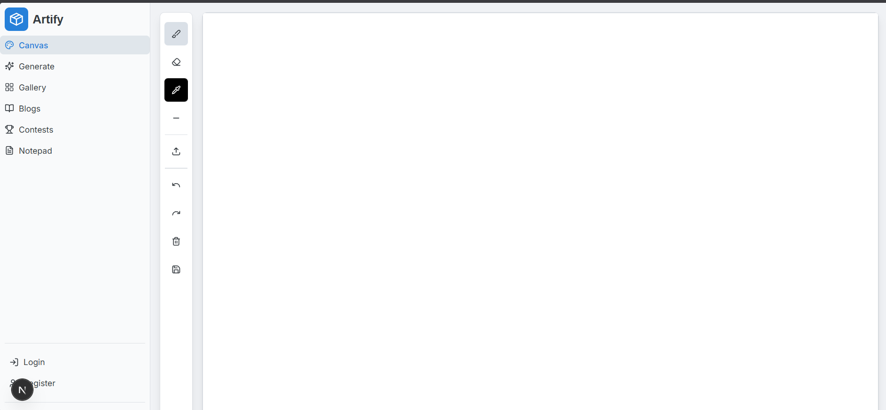
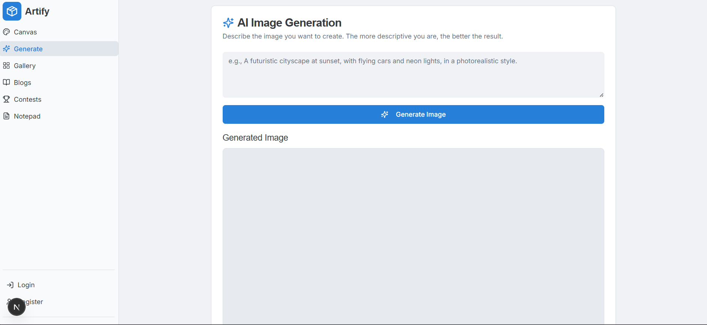
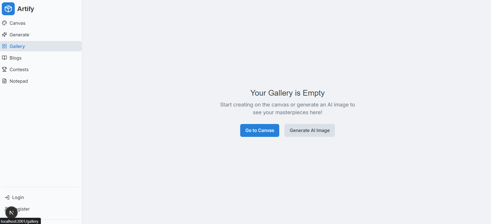
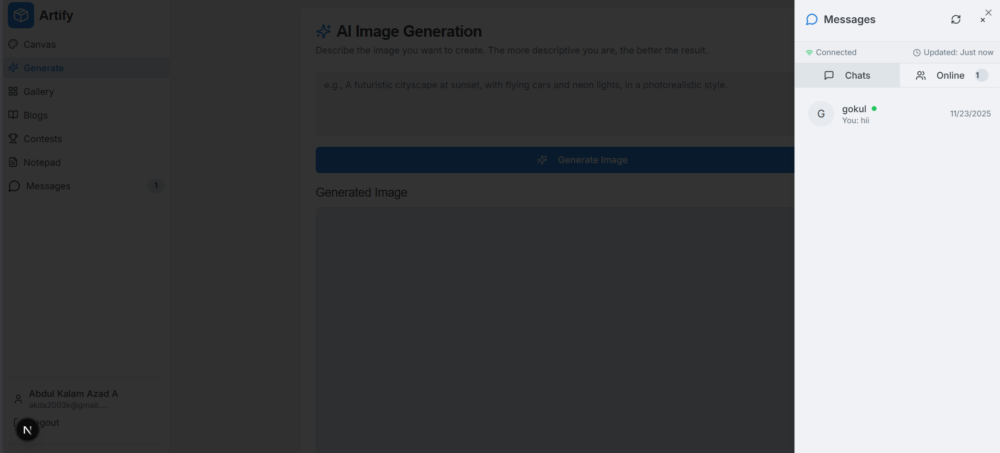

# DrawTogether 🎨

**DrawTogether** is a collaborative creative studio that combines real-time drawing with AI-powered enhancements. Create art with friends, generate images from prompts, and share your masterpieces in a global gallery.

## ✨ Features

- **🎨 Real-time Collaborative Canvas**: Draw with friends in real-time. Changes are synced instantly across devices.
- **🤖 AI Image Generation**: Turn your text descriptions into stunning images using Google Gemini & Stability AI.
- **💬 Integrated Chat**: Discuss ideas while you draw with built-in messaging.
- **🖼️ Gallery**: Save and showcase your artwork.
- **🛠️ Advanced Tools**: Layers, brush customization, color palettes, and more.

## 📸 Screenshots

### Collaborative Canvas


_Real-time drawing interface with tools and color picker._

### AI Generation


_Generate unique assets using AI prompts._

### Gallery & Dashboard


_Browse and manage your creative portfolio._

### Chat & Collaboration


_Real-time collaboration and messaging._


## 🚀 Getting Started

### Prerequisites

- Node.js 18+
- MongoDB Atlas Account
- Google AI API Key (for Genkit)
- Stability AI API Key (for Image Gen)

### Installation

1.  **Clone the repository**

    ```bash
    git clone https://github.com/yourusername/drawtogether.git
    cd drawtogether
    ```

2.  **Install dependencies**

    ```bash
    npm install
    ```

3.  **Set up Environment Variables**
    Create a `.env.local` file:

    ```env
    MONGODB_URI=your_mongodb_connection_string
    GOOGLE_GENAI_API_KEY=your_google_key
    STABILITY_API_KEY=your_stability_key
    ```

4.  **Run the development server**

    ```bash
    npm run dev
    ```

5.  Open [http://localhost:3000](http://localhost:3000) in your browser.

## ☁️ Deployment

This project is optimized for deployment on **Vercel** with **MongoDB Atlas**.

See [VERCEL_DEPLOY.md](VERCEL_DEPLOY.md) for detailed deployment instructions.

## 🛠️ Tech Stack

- **Frontend**: Next.js 15, TailwindCSS, Shadcn UI
- **Backend**: Next.js Server Actions, API Routes
- **Database**: MongoDB (Mongoose)
- **AI**: Google Genkit, Stability AI
- **Real-time**: Internal Polling System (Vercel compatible)

## � Author

**ABDUL KALAM AZAD A**

## �📄 License

This project is licensed under the MIT License.
